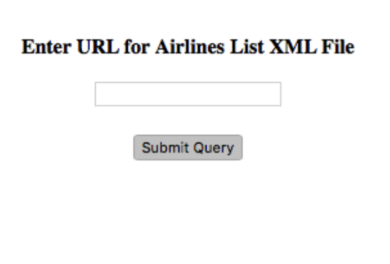
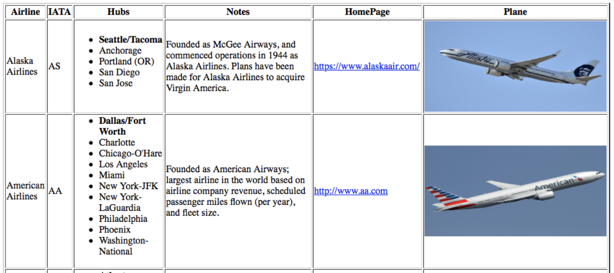

# Airline Data Parser
This project takes an XML document containing US Airlines information, parses the XML file, and extracts the list of airlines, displaying them in a table. There is a textbox to enter the XML file name. On clicking the “Submit Query” button, the program shows a table displaying the airline information. If the text box is left empty and Submit Query is clicked, an error message is shown.

### Landing page to submit query

### XML table display

